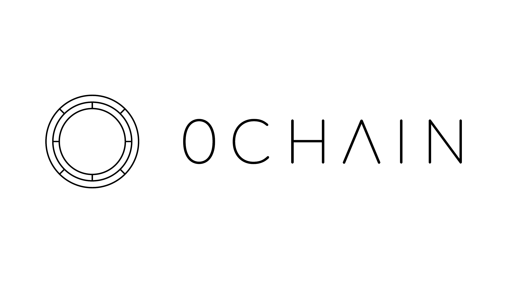

# 0chain

[0Chain](https://0chain.net/) is a decentralized blockchain-based storage platform with built-in privacy and security compliance. It provides high performance, enforceable SLAs, choice of providers for all enterprise grade applications.

[ZCN Token Economics](https://drive.google.com/file/d/1bxhjcx3SWUaUcgY8A2HBMcwc57Tg_Fjw/view)

# oe-zcn

This repository holds [`kas`](https://kas.readthedocs.io/en/latest/) configuration files for building `zcn`-focused Embedded Linux OSs.

Please refer to [`meta-zcn`](https://github.com/0chain/meta-zcn) for the OpenEmbedded layer and [Documentation](https://github.com/0chain/meta-zcn#documentation).
